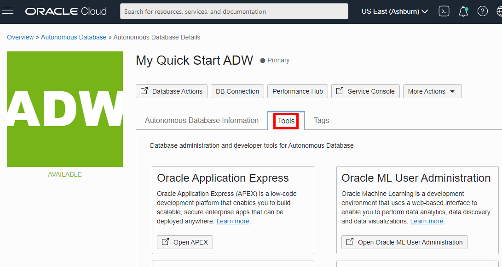
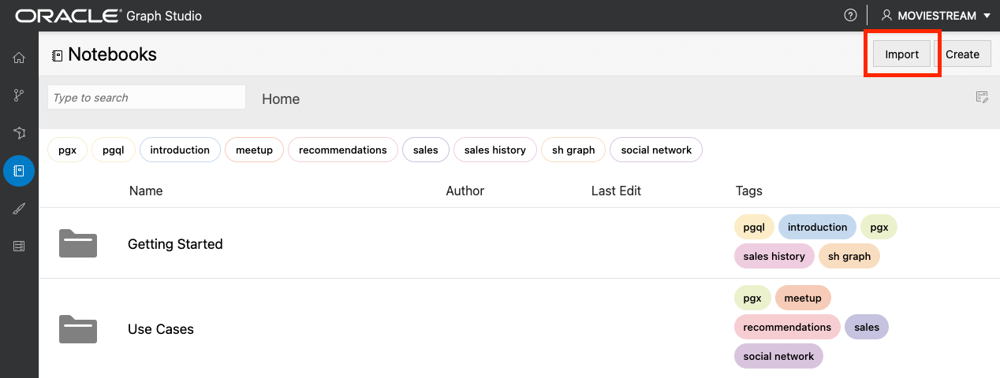

# Use graph analytics to recommend movies

## Introduction

#### Video Preview

Use Oracle Graph analytics to create customer communities based on movie viewing behavior. Once you've created communities - make recommendations based on what your community members have watched.

In this lab you will use graph analytics to identify movies to recommend to customers who are at risk of leaving.

Estimated Time: 10 minutes

### About graph
When you model your data as a graph, you can run graph algorithms on your data to analyze your data based on the connections and relationships in your data. You can also use graph queries to find patterns in your data, such as cycles, paths between vertices, anomalous patterns, and others. Graph algorithms are invoked using a Java or Python API, and graph queries are run using PGQL (Property Graph Query Language, see [pgql-lang.org](https://pgql-lang.org)).

In this lab you will use a graph created from the tables MOVIE, CUSTOMER\_PROMOTIONS, and CUSTSALES\_PROMOTIONS. MOVIE and CUSTOMER\_PROMOTIONS are vertex tables (every row in these tables becomes a vertex). CUSTSALES\_PROMOTIONS connects the two tables, and is the edge table. Every time a customer in CUSTOMER\_PROMOTIONS rents a movie in the table MOVIE, that is an edge in the graph. This graph has been created for you for use in this lab.  

You have the choice of over 60 pre-built algorithms when analyzing a graph. In this lab you will use the **WhomToFollow** algorithm that clusters users based on the movies they have rented. A customer in a cluster is likely to like movies liked by other customers in the same cluster. WhomToFollow is used in social network analysis to identify who you should follow; here we use it to identify movie recommendations that will most interest a customer.  

### Objectives

In this lab, you will use the Graph Studio feature of Autonomous Database to:
* Use a notebook
* Run a few PGQL graph queries
* Run WhomToFollow from the algorithm library
* Query the results

### Prerequisites

- This lab requires completion of Lab 1 and Lab 2.

## Task 1: Log into Graph Studio

Graph Studio is a feature of Autonomous Database. It is available as an option under the **Tools** tab. You need a graph-enabled user to log into Graph Studio. When you created the MOVIESTREAM user in Lab 2 you had graph-enabled that user.

1. In your Autonomous Database Details page, click the **Tools** tab and then **Graph Studio**.

    Click **Tools**.

        

    Scroll down and click **Graph Studio**.

    

2. Log in to Graph Studio. Use the credentials for the database user MOVIESTREAM.

    

## Task 2: Load a graph into memory

The MOVIE_RECOMMENDATIONS graph has been created for you from the tables CUSTOMER\_PROMOTIONS, CUSTSALES\_PROMOTIONS, and MOVIE (as explained earlier).  You will now load this graph from the database into the in-memory graph server.  

1. Click on the graphs icon.  You will see that the MOVIE_RECOMMENDATIONS graph is available.

    

    

2. Click on the 3 dots on the right and select **Load Graph Into Memory**.

    

3. Select **Yes**.  Next see that the load into memory is in progress.  About two minutes later the load job has completed.

    

    

    

 Click on the Graphs icon again to see that the graph is now in memory.  

    

## Task 3: Use a notebook to run graph queries and graph analytics

 You can import a notebook that has the graph queries and analytics. Each paragraph in the notebook has an explanation.  You can review the explanation, and then run the query or analytics algorithm.   

  [Click here to download the notebook](files/Movie_Movie_Recommendations.dsnb) and save it to a folder on your local computer.  This notebook includes graph queries and analytics for the MOVIE_RECOMMENDATIONS graph.

 1. Import a notebook by clicking on the notebook icon on the left, and then clicking on the **import notebook** icon on the far right.

     

 Click on the + sign and navigate to the folder where you just downloaded the notebook.  Select the notebook and click on **Import**.

     

 2. Review the description before each paragraph.   Review the graph queries and analytics.   You can then run the query by clicking on the triangle on the top right if you would like to do so.  Below is an example of running a query in a paragraph.  

     

 You can click on the **Settings** icon to change the visualization parameters.

     

     

## Learn more

* [LiveLabs](https://apexapps.oracle.com/pls/apex/dbpm/r/livelabs/view-workshop?wid=758&clear=180&session=900372122498)
* [Documentation](https://docs.oracle.com/en/cloud/paas/autonomous-database/graph-studio.html)
* [Get Started](https://www.oracle.com/autonomous-database/graph/get-started/)
* [Webpage](https://www.oracle.com/database/graph/)

## Acknowledgements
* **Author** - Melli Annamalai, Product Manager, Oracle Spatial and Graph
* **Contributors** -  Jayant Sharma
* **Last Updated By/Date** - Rick Green, Database User Assistance, November 2021
