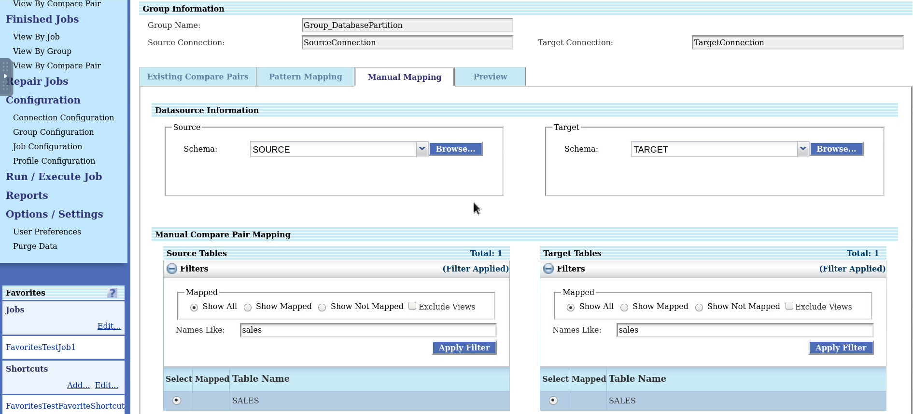
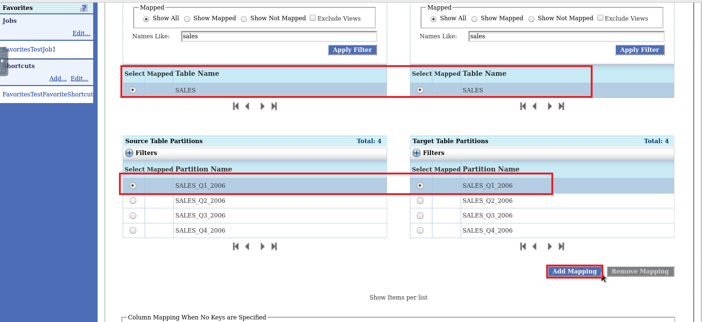

# Configure Database Row Partitions

## Introduction
This lab describes how to map existing database partitioning.

If you have the database tables partitions defined then, those partitions can be mapped and can be split further using Manual Row Partitions or Automatic Row Partitions. Compare pairs are generated per Table Partitions based on the selected mappings.

The database tables partitions are shown only when both source and target are Oracle and the tables have already partitions defined at database.

*Estimated Lab Time*: 20 minutes

Watch our short video that explains the partitioning feature in Oracle GoldenGate Veridata:

### Objectives
In this lab, you will:
* Create Database Row Partitioning.

### Prerequisites
This lab assumes you have:
- A Free Tier, Paid or LiveLabs Oracle Cloud account
- You have completed:
    * Lab: Prepare Setup (*Free-tier* and *Paid Tenants* only)
    * Lab: Environment Setup
    * Lab: Initialize Environment
    * Lab: Create Datasource connections
    * Lab: Create Groups and Compare Pairs. Create a Group by name **`Group_DBPartition`**.
    * Lab: Create Groups and Compare Pairs. Follow the Tasks 1 to 2 to create a compare pair.

## **Task 1:** Configure Database Row Partitioning
To configure Database Row Partitioning:
1. In the Oracle GoldenGate Veridata UI, click **Group Configuration**, select a group, click Edit, and click **Go to Compare Pair Configuration** to display the **Compare Pair Configuration** page.
2. Click **Manual Mapping**.
3. Select a Source **Schema** and a Target **Schema** under **Datasource Information**, and then select the tables from **Source Tables** and **Target Tables** for Manual Compare Pair Mapping. Enter:
    * Source schema: **SOURCE**
    * Target schema: **TARGET**
    * Source Table: **SALES**
    * Target Table: **SALES**

    

4. Select the source and target partitions from **Source Table Partitions** and **Target Table Partitions**:
    * Source Table Partitions: **SALES\_Q1\_2006**

    * Target Table Partitions: **SALES\_Q1\_2006**

    

5. Click **Add Mapping** to map the selected database Table Partitions. You can also map multiple database Table Partitions before generating the compare-pair.

    

6. Click **Generate Compare Pairs**. The control moves to the **Preview** tab.

    
7. Click **Save** to save the generated compare pair.

  The control moves to the **Existing Compare Pairs** tab.
  Notice the compare pairs that have been generated with Database Row Partition.

    

## Want to Learn More?

* [Oracle GoldenGate Veridata Documentation](https://docs.oracle.com/en/middleware/goldengate/veridata/12.2.1.4/index.html)
* [Configuring Partitions in Oracle GoldenGate Veridata ](https://docs.oracle.com/en/middleware/goldengate/veridata/12.2.1.4/gvdug/configure-workflow-objects.html#GUID-03B3876F-7A79-43BA-9E14-8B216BD8F3BB)

## Acknowledgements
* **Author** - Anuradha Chepuri, Principal UA Developer, Oracle GoldenGate User Assistance
* **Contributors** -  Sukin Varghese , Jonathan Fu, Rene Fontcha
* **Last Updated By/Date** - Rene Fontcha, LiveLabs Platform Lead, NA Technology, November 2021
