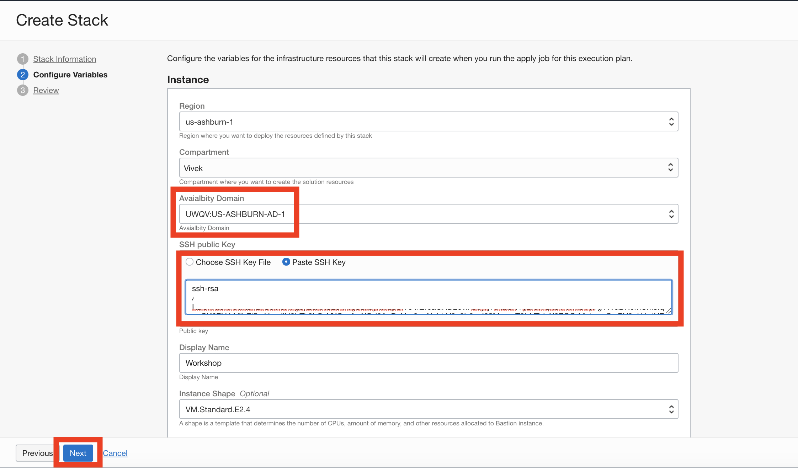
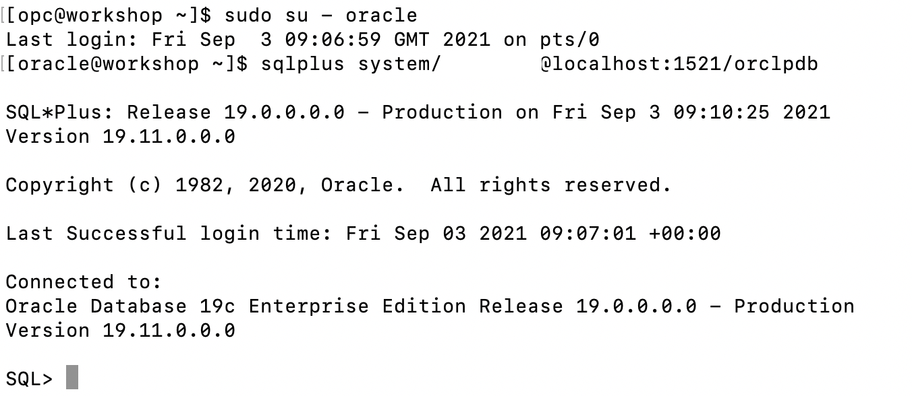

# Setup On-Premises Environment

## Introduction

In this lab you will setup an Oracle Cloud network (VCNs) and a compute instance with a pre-configured Oracle Database 19c using Oracle Resource Manager and Terraform. It is used to simulate the on-premises database.

Estimated Time: 30 minutes

### Objectives

-   Use Terraform and Resource Manager to setup the on-premise primary environment.

### Prerequisites

This lab assumes you have already completed the following:
- An Oracle Free Tier, Always Free, Paid or LiveLabs Cloud Account
- Create a SSH Keys pair

Click on the link below to download the Resource Manager zip files you need to build your environment.

- [db19c-primary.zip](https://objectstorage.us-ashburn-1.oraclecloud.com/p/hfu967L3r9EtJfSG4JqFc5JSIglAx3iBXLTj0y9VgERvFOz_wqWgYZvrp3zRP8uE/n/orasenatdpltintegration01/b/database-management-lab/o/db19c-primary.zip) - Packaged terraform primary database instance creation script.

## Task 1: Prepare the Primary Database

1. Log in to the Oracle Cloud Console, click the **Navigation Menu** in the upper left, navigate to **Developer Services**, and select **Stacks**. *Note*: If you are in a workshop, double check your region to ensure you are on the assigned region.

	

2. Click on **Create Stack**

     

3. Under **Stack Configuration** select the **.zip file**, Click the **Browse** link and select the primary database setup zip file (`db19c-primary.zip`) that you downloaded. Click **Open** to upload the zip file.

     

     Accept all the defaults and click **Next**.

4. Accept the default value of the "Instance Shape". Select a value for "Availability Domain". Paste the content of the public key you created before under "SSH public key",  and click **Next**.

     

5. Click **Create**.

     

6. Your stack has now been created! 
   *Note*: If you get an error about an invalid DNS label, go back to your Display Name, please do not enter ANY special characters or spaces. It will fail.

     

## Task 2: Terraform Plan (OPTIONAL)

When using Resource Manager to deploy an environment, execute a terraform **Plan** to verify the configuration. This is an optional step in this lab.

1.  [OPTIONAL] Click **Plan** to validate your configuration. This takes about a minute, please be patient.

     

     

     

     

## Task 3: Terraform Apply

When using Resource Manager to deploy an environment, execute a terraform **Plan** and **Apply**. Let's do that now.

1. At the top of your page, click on **Stack Details**.  Click the button, **Apply**. This will create your instance and install Oracle 19c. This takes about a minute, please be patient.

     

     

     

     

2. Once this job succeeds, click on **Job Resources** and click on the resource against _oci\_core\_instance_. Click on **Workshop** and this will take you to the **Instance details** page. You can get the **Public IP address** of the primary instance from the **Instance details** page. Congratulations, your environment is created! Time to log in to your instance to finish the configuration.

     
     
     

## Task 4: Connect to your Instance

### MAC or Microsoft Windows CYGWIN Emulator

1.  Open up a terminal (MAC) or cygwin emulator as the opc user. Enter the ssh command shown below and then type yes when prompted.

     
          ssh -i ~/.ssh/<sshkeyname> opc@<Your Compute Instance Public IP Address>
     

2. After successfully logging in, proceed to Task 5.

          ssh -i labkey opc@xxx.xxx.xxx.xxx
          The authenticity of host 'xxx.xxx.xxx.xxx (xxx.xxx.xxx.xxx)' can't be established.
          ECDSA key fingerprint is xxxxxxxxxxxxxxxxxxxxxxxxxxxxxxxxxx.
          Are you sure you want to continue connecting (yes/no/[fingerprint])? yes
          Warning: Permanently added 'xxx.xxx.xxx.xxx' (ECDSA) to the list of known hosts.
          Activate the web console with: systemctl enable --now cockpit.socket

          [opc@workshop ~]$

### Microsoft Windows using PuTTY

1.  Open up **PuTTY** and create a new connection.

2.  Enter a name for the session and click **Save**.

     

3.  Click **Connection** > **Data** in the left navigation pane and set the Auto-login username to root.

4.  Click **Connection** > **SSH** > **Auth** in the left navigation pane and configure the SSH private key to use by clicking Browse under Private key file for authentication.

5.  Navigate to the location where you saved your SSH private key file, select the file, and click Open. NOTE: You cannot connect if you are in an Oracle office location on clear-corporate (choose clear-internet) or using Oracle VPN.

     

6.  The file path for the SSH private key file now displays in the Private key file for authentication field.

7.  Click Session in the left navigation pane, then click Save in the Load, save or delete a stored session Step.

8.  Click Open to begin your session with the instance.

## Task 5: Verify the Database is Up

1.  From your connected session of choice **tail** the `buildsingle.log`, This file has the configuration log of the database.

     ```
     <copy>
     tail -f /u01/ocidb/buildsingle.log
     </copy>
     ```
     

2.  When you see the following message, the database setup is complete - **Completed successfully in** (so many) **seconds** (this may take up to 30 minutes).

3.  Run the following command to verify the database with the SID **ORCL** is up and running.

     ```
     <copy>
     ps -ef | grep ORCL
     </copy>
     ```

     

4. Verify the listener is running:

     ```
     <copy>
     ps -ef | grep tns
     </copy>
     ```

     

5.  Connect to the Database using SQL*Plus as the **oracle** user.

     ```
     <copy>
     sudo su - oracle
     sqlplus system/Ora_DB4U@localhost:1521/orclpdb
     </copy>
     ```


     

6.  To leave `sqlplus` you need to use the exit command. Copy and paste the text below into your terminal to exit sqlplus.

     ```
     <copy>
     exit
     </copy>
     ```

7.  Copy and paste the below command to exit from oracle user and become an **opc** user.

     ```
     <copy>
     exit
     </copy>
     ```

You now have a fully functional Oracle Database 19c instance **ORCL** running on Oracle Cloud Compute, the default pdb name is **orclpdb**. This instance is your primary Oracle Database.


You may now proceed to the next lab.

## Acknowledgements

- **Author** - Vivek Verma, Principal Cloud Architect, North America Cloud Engineering
- **Contributors** - Vivek Verma, Sriram Vrinda, Pratima Chennupati
- **Last Updated By/Date** - Vivek Verma, September 2021
